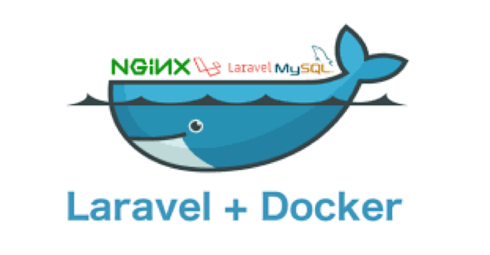

<!-- PROJECT LOGO -->
 

  

# Goals

1. Run a dev enviroment in Docker
    - Nginx / PHP
    - MySQL
    - Redis

2. `Dockerfile` to build a nginx/php image
3. Re-use existing images for MySQL/Redis