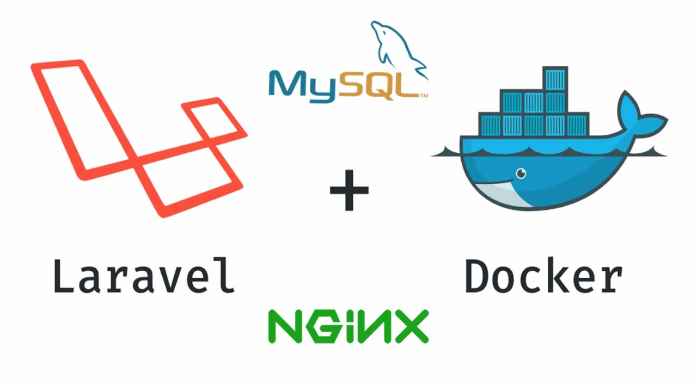
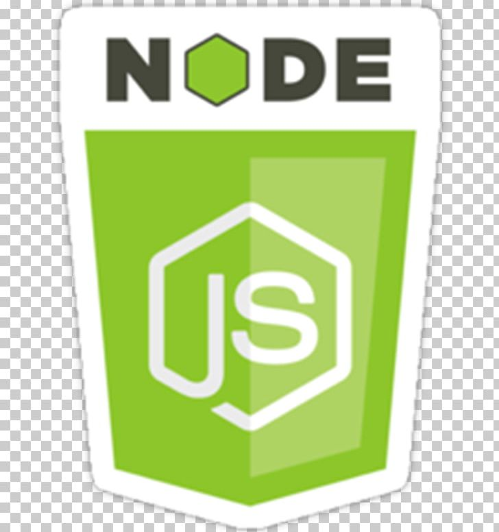

<!-- PROJECT LOGO -->
 

  

# Goals

1. Run a dev enviroment in Docker
    - Nginx / PHP 
    - MySQL 
    - Redis
    - NodeJs 
    - build up our helper script to accomplish using bash

2. `Dockerfile` to build a nginx/php image
3. Re-use existing images for MySQL/Redis
4. Re-use existing images for NodeJs